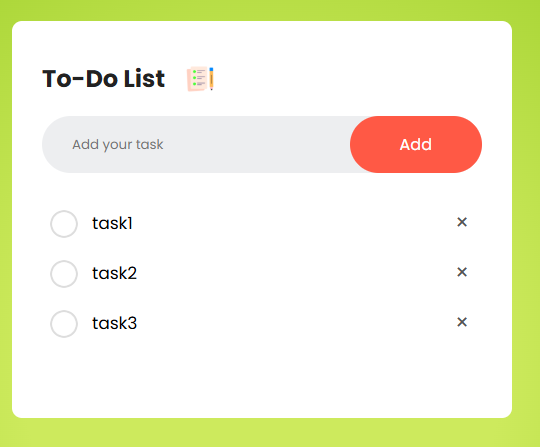

# Todo List App

This is a simple and colorful Todo List application built using **HTML**, **CSS**, and **JavaScript**. The app features **local storage** functionality, ensuring that your tasks are saved even if you close the application.



## Features
- Add, edit, and delete tasks.
- Mark tasks as completed.
- Persistent storage using **local storage**.
- Responsive and colorful user interface.

## How to Use
1. Open the application in your browser.
2. Add tasks using the input field and "Add" button.
3. Manage tasks by marking them as completed or deleting them.
4. Your tasks will remain saved even after closing the browser.

## Suggestions for Improvement
After reviewing the application, here are some suggestions for enhancements:
1. **Add a search/filter feature**: Allow users to search or filter tasks by keywords or status (e.g., completed or pending).
2. **Drag-and-drop reordering**: Enable users to reorder tasks using drag-and-drop functionality.
3. **Dark mode**: Add a toggle for light and dark themes.
4. **Task due dates**: Allow users to set due dates for tasks and highlight overdue tasks.
5. **Animations**: Add subtle animations for task addition, deletion, and completion for a smoother user experience.
6. **Accessibility improvements**: Ensure the app is fully accessible, including keyboard navigation and screen reader support.

## Installation
1. Clone the repository:
    ```bash
    git clone https://github.com/sameer-mohd09/SIMPLE-TODO.git
    ```
2. Open the `index.html` file in your browser.

## Technologies Used
- **HTML**: Structure of the application.
- **CSS**: Styling and layout.
- **JavaScript**: Functionality and interactivity.
- **Local Storage**: Persistent data storage.

## License
This project is licensed under the MIT License.
